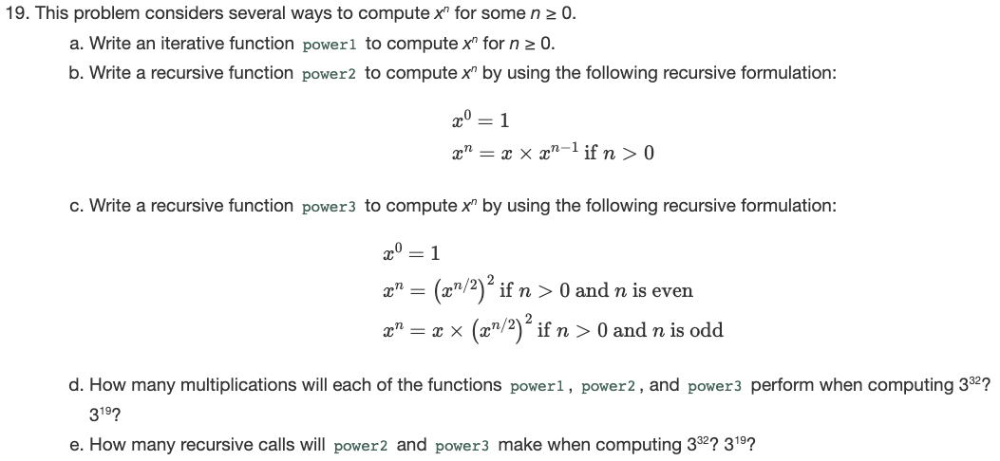

# HW02 - Exploring Recursive Functions

In this homework assignment, the student is presented with several solutions to finding the x^n for some n >= 0. Additionally, the different implementations are analyzed and compared.

## Due Date

This assignment is due Saturday, February 25, 2023 by 11:59:59 PM.

## Background

The basis for this homework assignment comes from Chapter 2, Exercise 19, repeated below for your convenience.



### Advanced Reading

- General > Files > Class Materials > Setting Up WSL for CSC232.pdf
- [Chapter 2 Recursion: The Mirrors](https://online.vitalsource.com/reader/books/9780134477473/epubcfi/6/62%5B%3Bvnd.vst.idref%3DP7001011925000000000000000000BEE%5D!/4/2%5BP7001011925000000000000000000BEE%5D/2/2%5BP70010119250000000000000000095A9%5D/7:16%5Bhe%20%2CMir%5D), Carrano & Henry textbook

## Objectives

Upon successful completion of this assignment, the student has

- implemented a solution to a problem using
  - iteration
  - recursion
- analyzed their solutions in terms of computational effort in terms of
  - operations performed
  - recursive invocations made

## Tasks

Each task in this assignment corresponds to one of the parts of Exercise 19.

1. Task 1: Iterative solution
2. Task 2: Recursive solution with one recursive case.
3. Task 3: Recursive solution with two recursive cases.
4. Task 4: Analysis 1 (Calculating number of multiplications performed)
5. Task 5: Analysis 2 (Calculating number of recursive calls)

### Task 1: Iterative solution.

Write an iterative function `power1` to compute x^n for some n >= 0.

1. Locate `TODO: Task 1.1` in [csc232.h](csc232.h) and declare the `power1` function. The return type of this function should be declared as `double`, and it should declare two parameters, the first being of type `double` (to represent _x_ in the expression _x_^_n_) and the second of type `int` (to represent _n_ in the expression _x_^_n_)
2. Locate `TODO: Task 1.2` in [csc232.cpp](csc232.cpp) and implement the function you declared in the previous step.
3. When you have completed this task, toggle the `SKIP_TESTING_TASK_1` macro from `TRUE` to `FALSE`.
4. Build and execute the `test_task1` target to test your solution. Alternatively, you can build and execute the `All CTest` target.
5. When all the tests for this task pass, commit and push your changes to GitHub.

### Task 2: Recursive solution with one recursive case.

Write a recursive function `power2` to compute x^n by using the following recursive formulation:

   ```text
   x^0 = 1
   x^n = x * x^(n - 1) if n > 0
   ```

1. Locate `TODO: Task 2.1` in [csc232.h](csc232.h) and declare the `power2` function. The return type of this function should be declared as `double`, and it should declare two parameters, the first being of type `double` (to represent _x_ in the expression _x_^_n_) and the second of type `int` (to represent _n_ in the expression _x_^_n_)
2. Locate `TODO: Task 2.2` in [csc232.cpp](csc232.cpp) and implement the function you declared in the previous step.
3. When you have completed this task, toggle the `SKIP_TESTING_TASK_2` macro from `TRUE` to `FALSE`.
4. Build and execute the `test_task2` target to test your solution. Alternatively, you can build and execute the `All CTest` target.
5. When all the tests for this task pass, commit and push your changes to GitHub.

### Task 3: Recursive solution with two recursive cases.

Write a recursive function `power3` to compute x^n by using the following recursive formulation:

   ```text
   x^0 = 1
   x^n = (x^(x/2))^2 if n > 0 and n is even
   x^n = x * (x^(x/2))^2 if n > 0 and n is odd
   ```

1. Locate `TODO: Task 3.1` in [csc232.h](csc232.h) and declare the `power3` function. The return type of this function should be declared as `double`, and it should declare two parameters, the first being of type `double` (to represent _x_ in the expression _x_^_n_) and the second of type `int` (to represent _n_ in the expression _x_^_n_)
2. Locate `TODO: Task 3.2` in [csc232.cpp](csc232.cpp) and implement the function you declared in the previous step.
3. When you have completed this task, toggle the `SKIP_TESTING_TASK_3` macro from `TRUE` to `FALSE`.
4. Build and execute the `test_task3` target to test your solution. Alternatively, you can build and execute the `All CTest` target.
5. When all the tests for this task pass, commit and push your changes to GitHub.

### Task 4: Analysis 1 (Calculating number of multiplications performed).

> How many multiplications will each of the functions `power1`, `power2`, and `power3` perform when computing 3^32? 3^19?

1. Open the file [task4_answers.txt](task4_answers.txt).
2. Answer these questions in tabular form, where the rows are each of the functions (power1, power2, and power3) and the two columns are 3^32 and 3^19. For example

   ```text
   100 50
   100 50
   100 50
   ```

   DO NOT add any column or row headers, only put the data (the answer for each question). Namely, this table is in essence

   ```text
   power1_num_of_mult(3^32)   power1_num_of_mult(3^19)
   power2_num_of_mult(3^32)   power2_num_of_mult(3^19)
   power3_num_of_mult(3^32)   power3_num_of_mult(3^19)
   ```

3. When you have completed this task, toggle the `SKIP_TESTING_TASK_4` macro from `TRUE` to `FALSE`.
4. Build and execute the `test_task4` target to test your solution.  Alternatively, you can build and execute the `All CTest` target.
5. When all the tests for this task pass, commit and push your changes to GitHub.

### Task 5: Analysis 2 (Calculating number of recursive calls).

> How many recursive calls will `power2` and `power3` make when computing 3^32? 3^19?

1. Open the file [task5_answers.txt](task5_answers.txt).
2. Answer these questions in tabular form, where the rows are each of the functions (`power2`, and `power3`) and the two columns are 3^32 and 3^19. For example

   ```text
   100 50
   100 50
   ```

   DO NOT add any column or row headers, only put the data (the answer for each question). Namely, this table is in essence

   ```text
   power2_num_calls(3^32)   power2_num_calls(3^19)
   power3_num_calls(3^32)   power3_num_calls(3^19)
   ```

3. When you have completed this task, toggle the `SKIP_TESTING_TASK_5` macro from `TRUE` to `FALSE`.
4. Build and execute the `test_task5` target to test your solution.  Alternatively, you can build and execute the `All CTest` target.
5. When all the tests for this task pass, commit and push your changes to GitHub.

## Submission Details

Before submitting your assignment, be sure you have pushed all your changes to GitHub. If this is the first time you're pushing your changes, the push command will look like:

```bash
git push -u origin develop
```

If you've already set up remote tracking (using the `-u origin develop` switch), then all you need to do is type:

```bash
git push
```

As usual, prior to submitting your assignment on Blackboard, be sure that you have committed and pushed your final changes to GitHub. Once your final changes have been pushed, create a pull request that seeks to merge the changes in your `develop` branch into your `trunk` branch. Once your pull request has been created, submit the URL of your assignment _repository_ (i.e., _not_ the URL of the pull request) on the Teams Assignment. Please note: the timestamp of the submission on Teams is used to assess any late penalties if and when warranted, _not_ the date/time you create your pull request. **No exceptions will be granted for this oversight**.

### Grading Rubric

This assignment is worth **3 points**.

| Criteria           | Exceeds Expectations         | Meets Expectations                  | Below Expectations                  | Failure                                        |
|--------------------|------------------------------|-------------------------------------|-------------------------------------|------------------------------------------------|
| Pull Request (20%) | Submitted early, correct url | Submitted on-time; correct url      | Incorrect URL                       | No pull request was created or submitted       |
| Code Style (20%)   | Exemplary code style         | Consistent, modern coding style     | Inconsistent coding style           | No style whatsoever or no code changes present |
| Correctness^ (60%) | All unit tests pass          | At least 80% of the unit tests pass | At least 60% of the unit tests pass | Less than 50% of the unit tests pass           |

^ _The Google Test unit runner will calculate the correctness points based purely on the fraction of tests passed_.

### Late Penalty

* In the first 24-hour period following the due date, this lab will be penalized 0.6 point meaning the grading starts at 2.4 (out of 3 total possible) points.
* In the second 24-hour period following the due date, this lab will be penalized 1.2 points meaning the grading starts at 1.8 (out of 3 total possible) points.
* After 48 hours, the assignment will not be graded and thus earns no points, i.e., 0 out of 3 possible points.
